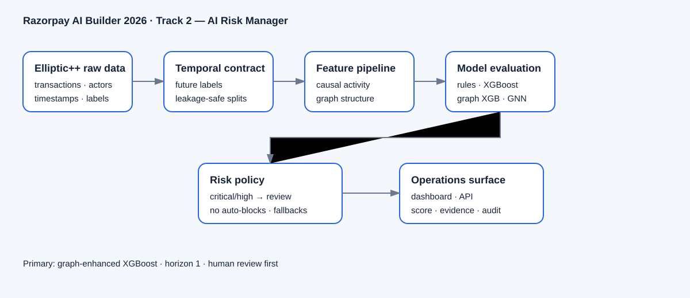

# Architecture and AI-Judgment Notes

## System flow

The system is organized as a reproducible research pipeline and a review-first operations surface:

1. Elliptic++ raw transactions are preserved unchanged.
2. Temporal labels define future illicit activity without using future information in features.
3. Causal actor-time features describe recent and cumulative behavior.
4. Temporal graph snapshots produce structural features such as counterparties, degree, and new links.
5. Rules, causal XGBoost, graph XGBoost, and a temporal GNN are evaluated using rolling temporal folds.
6. Graph-enhanced XGBoost is selected because it has the best measured rolling mean AP.
7. Scores are converted into monitor/high/critical bands.
8. Alerts are presented with evidence and routed to human review.
9. The dashboard can use recorded predictions or the local inference API.

## Where the AI judgment is

### Model choice

The project did not assume that a GNN was automatically superior because the data is a graph. A temporal GNN ablation was measured against a simpler graph-enhanced XGBoost model. The GNN reached mean AP `0.0650`; graph-enhanced XGBoost reached `0.0677`, so the simpler model was selected.

### Temporal reasoning

The target is future activity, not the label of the current transaction. Features stop at the current timestep, and evaluation follows time order.

### Operational judgment

Model probability is treated as a prioritization signal, not a verdict. The policy keeps a human in the loop, exposes evidence, and disables automatic blocks.

### Failure judgment

Missing evidence becomes `insufficient_evidence`. Model outage becomes rules-only monitoring. Capacity overflow defers alerts rather than discarding them.

## Main contracts

- Label contract: `data/processed/temporal_contract/actor_early_warning_labels.csv`
- Split contract: `data/processed/temporal_contract/splits/`
- Feature manifests: `data/processed/temporal_contract/causal_features/` and `graph_features/`
- Model metadata: `models/xgb_graph_horizon1.metadata.json`
- Prediction contract: `demo/data/risk_ops_snapshot.json`
- API contract: `/health`, `/ready`, `/metrics`, `/alerts`, `POST /score`

## Safety and limits

- Elliptic++ is not Razorpay traffic.
- Validation positives are sparse and threshold estimates vary across folds.
- Shadow mode found alert volume too high under the current absolute threshold.
- The synthetic 20,000-row stream is only a capacity-testing proxy.
- No customer-impacting action is enabled.
- Production deployment requires authorized representative data, calibration, authentication, monitoring, audit storage, rollback, and risk approval.
